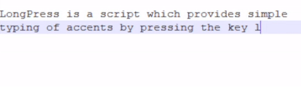

LongPress
=========

AutoHotkey Script to show a small popup for entering accented or
other special characters. The popup shows when LongPressing a
character, after which a related character can be chosen
(or backspace or escape pressed). For example long-pressing the
'e' character will give the option to switch it to an é or è.

I created this script when I had to use a Windows machine. On a Mac
this is standard functionality that was sorely missed on Windows.
There exists (commercial) software that does this on Windows
(like [Holdkey](https://holdkey.eu)),
but it requires admin rights to install which I did not have.
(I used Scoop, which doesn't need admin rights, to install AutoHotkey)

Note that Windows often doesn't know where the active cursor is so
this script defaults to center of active window if not found.

When an accent is missing you can easily add it yourself in the
script. The existing accents are examples on how to add. There are
thousands of special characters so only a few that are used mostly
(in the West anyway) were added to the script by default.

It is also possible to select phrases instead of just a
character when long-pressing. An example exists in the script for
the back-tick.

An 'LP' icon is added in the tray when LongPress is running.

Just double-click the LongPress.ahk to start. To autostart it,
look [here](https://google.com/search?q=windows+how+to+autostart)

[//]: # (a google link is added because other links are very long)
